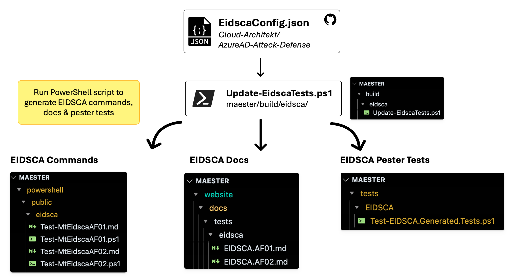

import TOCInline from '@theme/TOCInline';

# Contributing

<TOCInline toc={toc} />

## Introduction

This guide is for anyone who wants to contribute to the Maester project. Whether you want to contribute to the code, documentation, or just have an idea for a new feature, we welcome your input.

Follow the guide below to set up Maester for development on your local machine, make changes, and submit a pull request.

## Maester PowerShell module dev guide

### Simple debugging

- Set a breakpoint anywhere in the code and hit F5
- The launch.json has been configured to re-load the module

### Manual editing

- Load the PowerShell module. This needs to be done anytime you make changes to the code in `./powershell`.
  - `Import-Module ./powershell/Maester.psd1 -Force`
- Run Maester
  - `Invoke-Maester`

### Pester Tests

- Tests for the Maester module are at /powershell/tests
- When making changes to the module you can run the test locally by running `/powershell/tests/pester.ps1`
- The **PSScriptAnalyzer**, **PSFramework** and **PSModuleDevelopment** modules are required to run the tests, install them with `Install-Module PSFramework, PSModuleDevelopment, PSScriptAnalyzer`
- The tests are run automatically on PRs and commits to the main branch and will fail if the tests do not pass


## Contributing to Maester docs

Simple edits can be made in the GitHub UI by selecting the `Edit this page` link at the bottom of each page or you can browse to the [docs](https://github.com/maester365/maester/tree/main/website/docs) folder on GitHub.

For more complex changes, you can fork the repository and submit a pull request.

The docs/commands folder is auto-generated based on the comments in the PowerShell cmdlets. If you want to update the documentation for a command, you will need to update the comment-based help in the .ps1 file for the command.

## Contributing new tests and updating existing tests

### Test folder convention

We have the following [test](https://github.com/maester365/maester/tree/main/tests) folders:

- `/CISA` - CISA tests
- `/Custom` - Folder for user's to add tests (do not add any tests to this folder).
- `/EIDSCA` - EIDSCA tests
- `/Maester` - Maester tests
  - `/Entra` - Maester's Entra tests

### Checklist for writing good tests

When contributing tests, please ensure the following:

- [x] The test is not already covered by an existing test
- [x] The test has a unique tag so it can be run independently (e.g. `Invoke-Maester -Tag MS.AAD.5.1`)
- [x] The Pester file `Test-Mt<Name of test>.Tests.ps1` is easy to understand.
- [x] The related cmdlet for the test has a .md file to explain the test in detail and provides all the context required for the user to resolve the issue, including deep links to the admin portal page to resolve the issue. This will be shown to the user when they view the test report. The file should include:
  - [x] Link to the admin portal blade where the setting can be configured
  - [x] If there are multiple objects (e.g. list of CA policies, Users, etc) then use the `GraphObjects` and `GraphObjectType` parameters in [Add-MtTestResultDetail](https://github.com/maester365/maester/blob/main/powershell/public/Add-MtTestResultDetail.ps1). These include deep links to the admin portal. If the object type you wish is not available you can add it to [Get-GraphObjectMarkdown.ps1](https://github.com/maester365/maester/blob/main/powershell/internal/Get-GraphObjectMarkdown.ps1). Feel free to ask on Discord if you need help with this.
  - [x] If the test is about a specific setting the message should link to the page where the setting can be configured. The .md file should also include steps to configure the setting as well as a link to the admin portal. For a good example of a well written error page see [Test-MtCisaWeakFactor.ps1](https://github.com/maester365/maester/blob/main/powershell/public/cisa/entra/Test-MtCisaWeakFactor.ps1). Another good example is [Test-MtCisaAppUserConsent.ps1](https://github.com/maester365/maester/blob/main/powershell/public/cisa/entra/Test-MtCisaAppUserConsent.ps1) and the related [Test-MtCisaAppAdminConsent.md](https://github.com/maester365/maester/blob/main/powershell/public/cisa/entra/Test-MtCisaAppAdminConsent.md).

When in doubt always check the existing tests for the conventions used, feel free to discuss on [Discord](https://discord.entra.news) or [GitHub Issues](https://github.com/maester365/maester/issues).

### Updating EIDSCA tests and documentation

The EIDSCA tests and documentation are maintained in the [EIDSCA repository → EidscaConfig.json](https://github.com/Cloud-Architekt/AzureAD-Attack-Defense/blob/AADSCAv4/config/EidscaConfig.json) file.

The [/build/eidsca/Update-EidscaTests.ps1](https://github.com/maester365/maester/blob/main/build/eidsca/Update-EidscaTests.ps1) script is used to generate the EIDSCA commands in the Maester module along with the EIDSCA tests and documentation.

The script is currently run manually and is not automated as part of the build process as we need to verify the changes before they are committed.

The illustration below shows the workflow for integrating EIDSCA tests and documentation into Maester.



When generating the EIDSCA commands and tests, manual verification should be performed to ensure the EIDSCA tests are being run correctly and the results are accurate.

## Running documentation locally

The [Maester.dev](https://maester.dev) website is built using [Docusaurus](https://docusaurus.io/).

Follow this guide if you want to run the documentation locally and view changes in real-time.

### Pre-requisites

[Node.js](https://nodejs.org/en/download/) version 18.0 or above (which can be checked by running node -v). When installing Node.js, you are recommended to check all checkboxes related to dependencies.

### Installation

When running the documentation for the first time, you will need to install the dependencies. This can be done by running the following command in ./website folder.

```
npm install
```

### Starting the site

While in the ./website folder run the following command to start the site locally. This will start a local server and open the site in your default browser to http://localhost:3000/

```
npm start
```

### Editing content

You will now be able to edit add and edit markdown files in the ./website/docs folder and see the changes in real-time in your browser.

- Read the [markdown documentation](https://docusaurus.io/docs/markdown-features) for more information on some of the custom markdown features available.
- You can search for icons at [Iconify](https://icon-sets.iconify.design/) and include them in the markdown. See the [Daily Automation](https://maester.dev/docs/automation/) page for examples.
- The `Command Reference` section is auto-generated. To update the documentation for this, the .ps1 file for the command needs to be updated with comment-based documentation.

